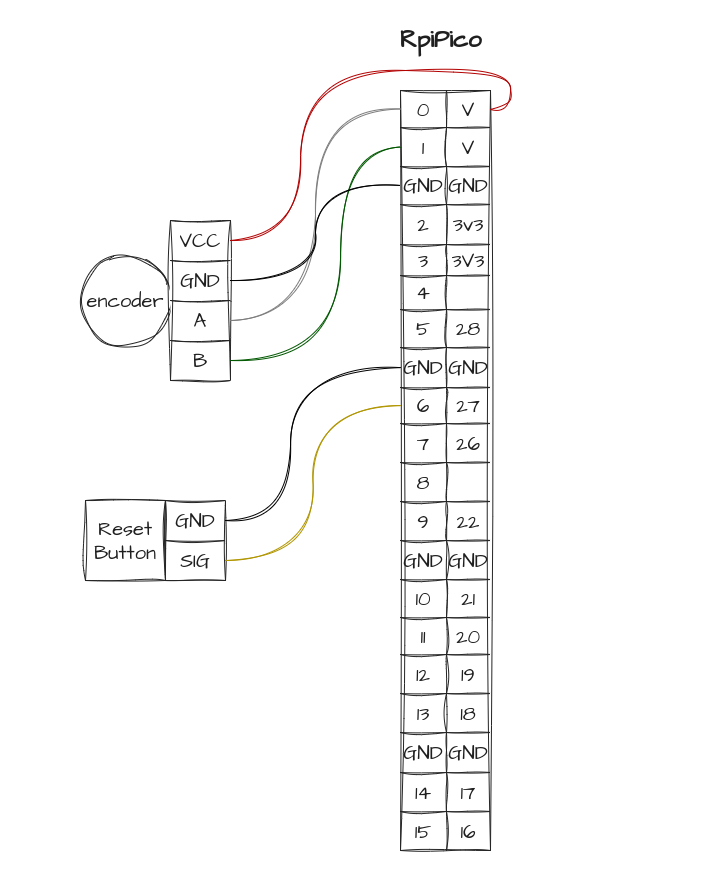

# reve_de_l-automate
Déployé dans le cadre du festival Recto VRso @LavaL 2025. Dispositif d'expérimentation de rêves collectivement construits.

https://www.instagram.com/reel/DIYxOZmNZea/

*teaser*
[

## requierements

- `pip install flask flask-socketio python-osc gTTS`
- [ollama](https://ollama.com/)

## How it works

We works with two differents version : 

- karaoke speaker\
Launch ollama/flask_karaoke/karaoke.py. It will launch a server that wait for :
    - `/filenametxt` send by interact.py
    - `/position` send by the MCU. A simple calculation to match the lentgh of the dolly cam with the length of the .txt file.

- machine sound\
Launche the PureData patch. It will wait for : 
    - `/filname` send by `convert_to_audio.py`
    - `/speed` send by the MCU. The dolly control the speed of the reading tab in puredata. (clip from -2 to 2)

The both solution need a OSC server. We can combine by using a different computer to launch the flask server. 

## Ollama

For this project we only used the Modelfile to pre-prompt the model. Can find in `ollama/model/ModelFile`. All details [here](https://github.com/ollama/ollama/blob/main/docs/modelfile.md)

The base model we used is gemma3.

## Machine setup

### MCU

Thanks to [SpotlightKid](https://github.com/SpotlightKid/micropython-osc) for the osc lib port with micropython.

We used a simple Raspberry Pico and [encoder from dfrobot](https://wiki.dfrobot.com/Incremental_Photoelectric_Rotary_Encoder_-_400P_R_SKU__SEN0230) to send the dolly's position and the dolly's speed. All details in `upython/encoder`

### Engineering

The main axe is en square steel 50*50mm 2m long.

The structure is made with regular alumuminium Type I slots 40*40mm

Blender file is available in `3D` folder

All print parts are available in `3D/prints`.

Thx to [droftarts](https://www.thingiverse.com/droftarts/designs) for his parametric pulley generator with OpenScad.

### Electronic

Pretty simple connections.

## WTF

Sometimes this issue comes from nowhere

Infinite loop

 

 
<a property="dct:title" rel="cc:attributionURL" href="https://github.com/lan-ensad/reve_de_l-automate">Rêve de l'automate</a> by <a rel="cc:attributionURL dct:creator" property="cc:attributionName" href="https://github.com/lan-ensad">Olivier Bienz</a> is licensed under <a href="https://creativecommons.org/licenses/by-nc-sa/4.0/?ref=chooser-v1" target="_blank" rel="license noopener noreferrer" style="display:inline-block;">CC BY-NC-SA 4.0</a>
 
